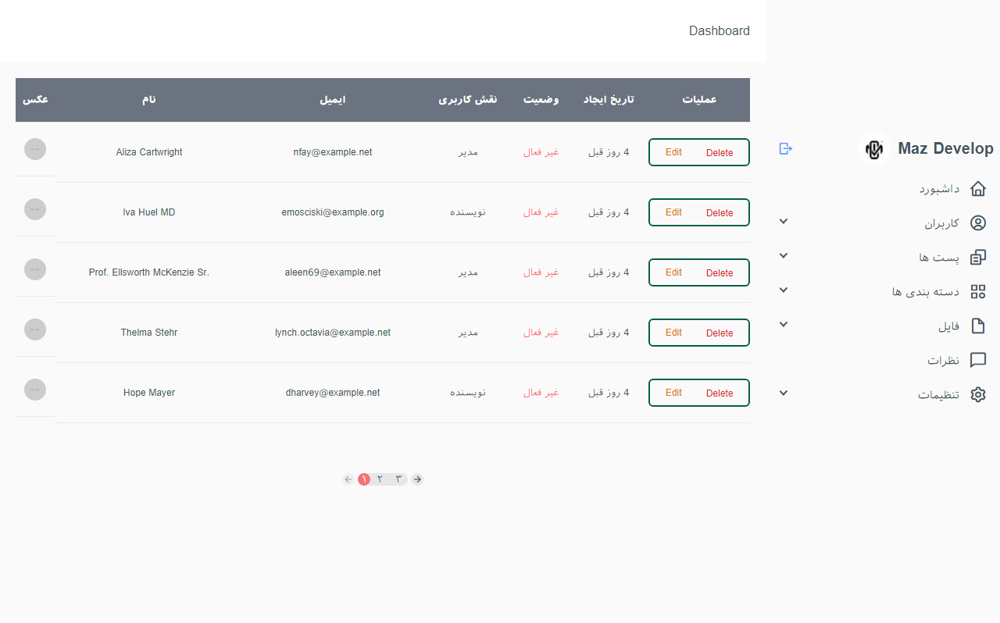

## About Varzesh 3
Varzesh 3 is a group of British subscription television sports channels operated by the satellite pay-TV company Sky, a division of Comcast.We redesigned this site with the help of Laravel and Tailwind.

## Packages
- [Laravel UI](https://github.com/laravel/ui)
- [doctrine/dbal](https://github.com/doctrine/dbal)

## Requirements
- PHP 7.3/8

## Todo
- [x] ~~Create Panel Admin By Tailwind~~
- [x] ~~CRUD User~~
- [x] ~~CRUD Post~~
- [x] ~~CRUD Category~~
- [x] ~~Dropzone.js for file~~
- [x] ~~Pagination and Dashboard~~
- [x] ~~Frontend & SeoFriendly Url~~
- [x] ~~Comment~~ 
- [x] ~~Bulk selecting of checkboxes per table using javascript & Laravel~~

## Credits
- All Contributors

## License
The MIT License [MIT license](https://opensource.org/licenses/MIT). Please see License File for more information.

## Screenshots
-Admin dashboard

-Admin user

-Front

